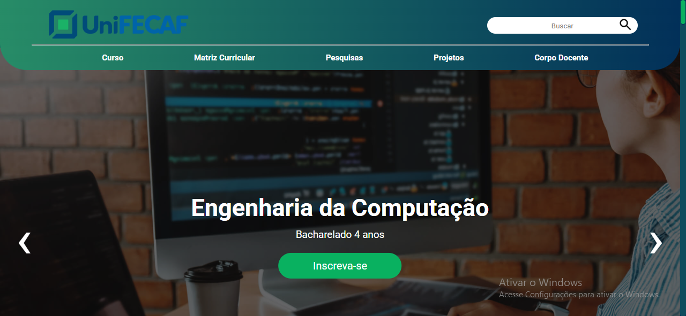
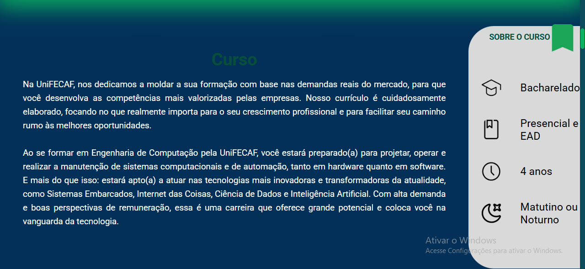
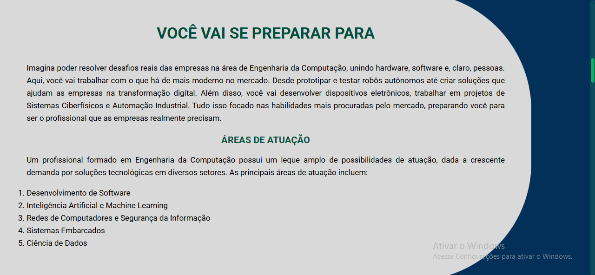
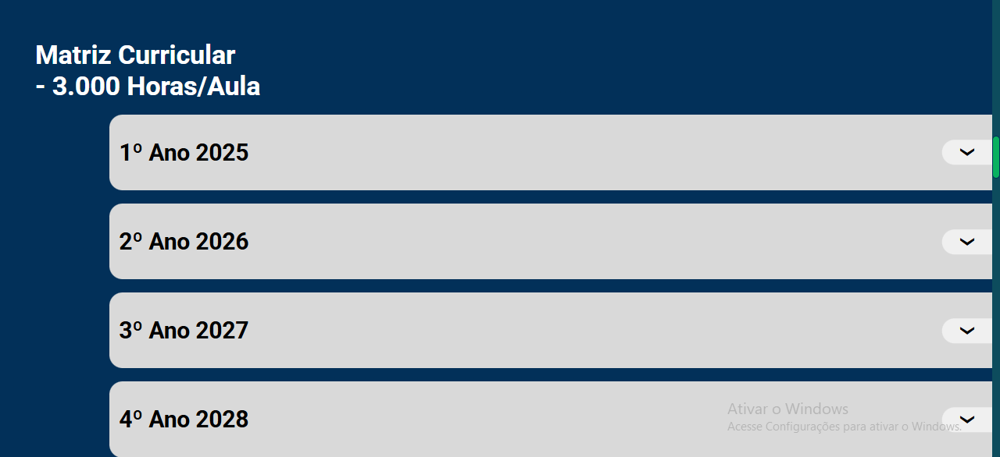
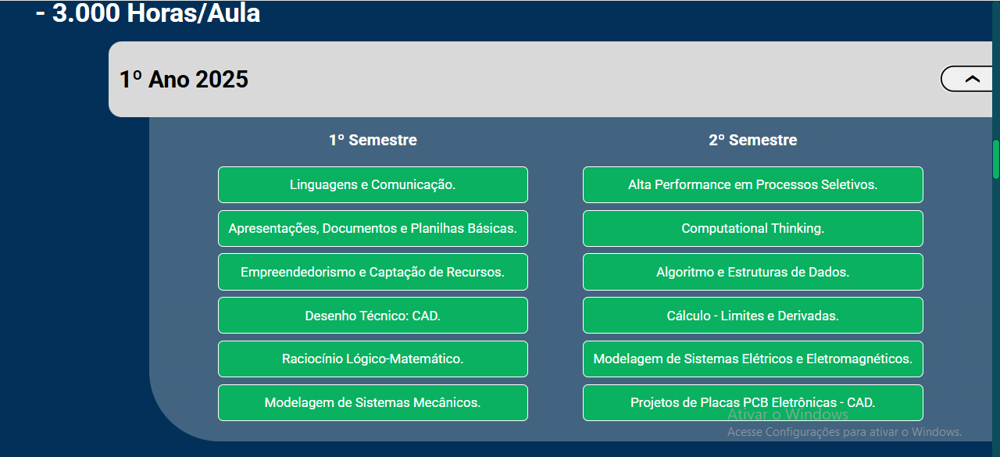
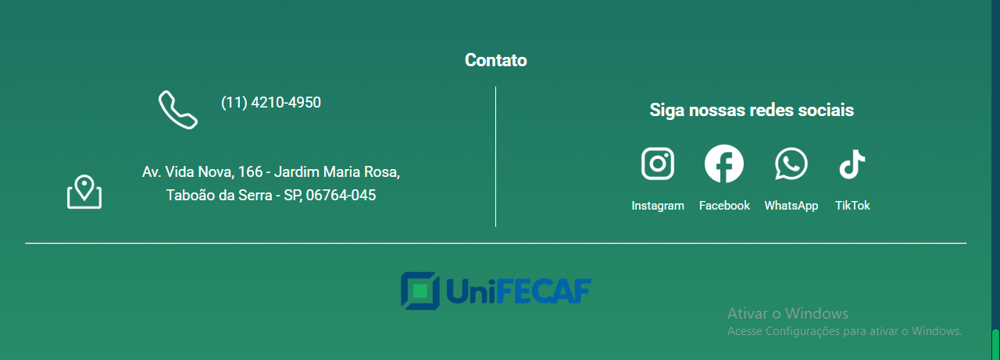

# FecafWebSite
Projeto do homepage de engenharias do site da minha universidade. 

# 🌐 Projeto Front-End – Página do Curso (Universidade)

Este projeto foi desenvolvido por mim e minha equipe de **7 integrantes** como parte de uma atividade acadêmica na faculdade.  
O objetivo foi criar uma **página web institucional** para apresentar informações sobre o curso e a universidade, com foco em usabilidade, design responsivo e navegação intuitiva.  

> ⚠️ Este repositório **não contém código-fonte**.  
> Ele serve apenas como **demonstração** das telas e da proposta do projeto.

---

## ✨ Funcionalidades Principais
- 🖼️ **Seção de destaque** no topo com imagens rotativas de Engenharia da Computação, Produção e Civil (em CSS).  
  - Exibe inicialmente **Engenharia da Computação** e permite navegar entre cursos com setas.  
- 📘 **Apresentação do curso** com informações sobre a área e sobre a universidade.  
- 🎯 **“Você vai se preparar para”** – seção motivacional com destaque para as habilidades e competências desenvolvidas.  
- 📚 **Matriz Curricular** interativa:  
  - Cada semestre é clicável e se expande para exibir suas disciplinas.  
- 📝 **Exemplo da Matriz Curricular** – detalhando o **primeiro semestre**.  
- 🚀 **Projetos acadêmicos e corpo docente** (sem imagens por conter rostos de estudantes e professores).  
- 📞 **Contato** com links para redes sociais e informações da universidade.  

---

## 🖼️ Telas do Sistema

### 🔝 Seção Superior (Header + Cursos)

### 📘 Informações sobre o Curso

### 🎯 Você Vai se Preparar Para

### 📚 Matriz Curricular (Semestres Interativos)

### 📝 Amostra do Primeiro Semestre

### Projetos e Corpo Docete
(Ocultados por fins de direitos de imagem){"Mostra o rosto de individuos reais"}

### 📞 Contato

---

## 📚 Sobre o Projeto
- Desenvolvido por **uma equipe de 7 alunos**.  
- Construído em **HTML, CSS e JavaScript** (apenas front-end).  
- Focado em **interatividade e experiência do usuário**.  
- Foi parte de uma seleção de projetos acadêmicos — embora não tenha sido o escolhido para deploy institucional, representou um **exercício completo de trabalho em equipe e desenvolvimento web**.  

---

## 📄 Licença
Este repositório é apenas de **demonstração**.  
As imagens e descrições são de uso exclusivo do autor e equipe.  
